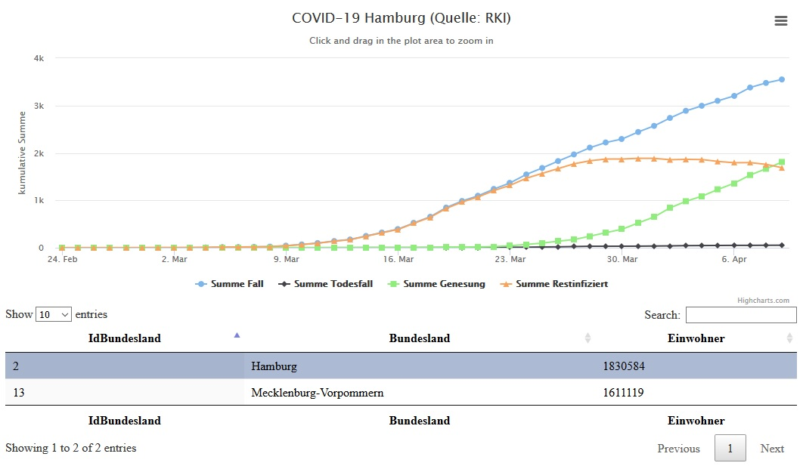
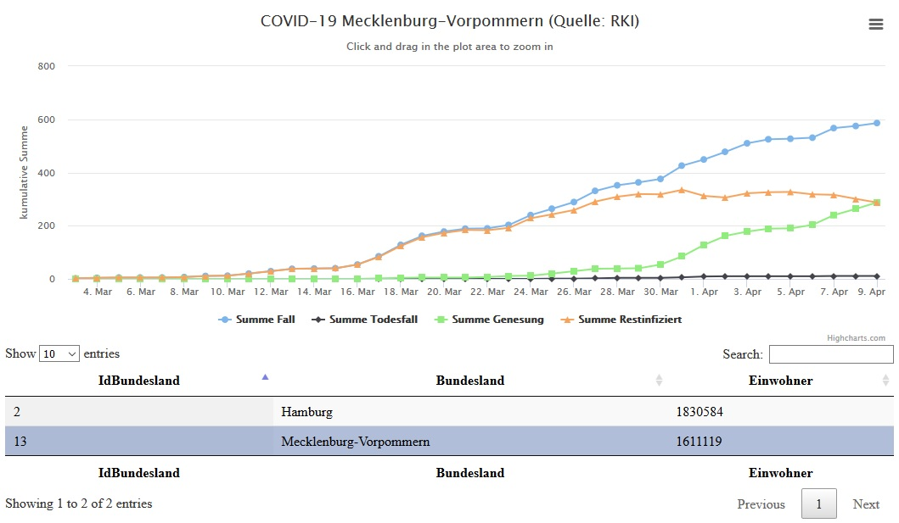

#

COVID-19 Charts WebApp
======================

## Inhalt
* [Einleitung](#einleitung)
* [Vorbereitung COVID-19 Daten](#vorbereitung-covid-19-daten)
* [COVID-19 WebApp](#covid-19-webapp)
* [Summary](#summary)
* [Wie es weiter geht](future.md)

## Einleitung
Die Coronavirus-Krankheit [COVID-19]( https://www.rki.de/DE/Content/InfAZ/N/Neuartiges_Coronavirus/Steckbrief.html) werden wir wohl nicht so schnell los. Zur Visualisierung der Fallzahlen gibt es zahlreiche ArcGIS Dashboards, z.B. vom [Robert Koch-Institut]( https://experience.arcgis.com/experience/478220a4c454480e823b17327b2bf1d4) oder der [Johns Hopkins University]( https://gisanddata.maps.arcgis.com/apps/opsdashboard/index.html#/bda7594740fd40299423467b48e9ecf6).

Die kumulierten Summen sind erschreckend. Mit Stand *14. April 2020* bereits *1.934.583* positiv getestete und *120.863* verstorbene Fälle. Aber diese Zahlen allein erlauben keine Einschätzung der aktuellen Lage. Mir fehlen dafür die Informationen zur Entwicklung der genesenen und der noch infizieren Personen. Darum habe ich mir selbst ein kleines Dashboard erstellt.

## Vorbereitung COVID-19 Daten
Für das Dashboard verwenden wir Daten vom [Robert Koch-Institut]( https://npgeo-corona-npgeo-de.hub.arcgis.com/). Die Anzahl der genesenen Fälle wird geschätzt und darauf aufbauend die Anzahl der noch infizierten Fälle berechnet. Wie, das ist in diesem Jupyter Notebook [IPYNB-File](src/py/pub_covid19.ipynb) zu sehen. Dabei beruht die Schätzung auf einer einfachen Annahme. Werden heute z.B. 73 Personen positiv getestet und 3 sind infolge der Krankheit verstorben, dann gelten 70 Überlebende nach Ablauf von 14 Tagen als genesen. Nach dieser Schätzung kommen wir für den 9.4.2020 auf 1.810 genesene Fälle in Hamburg, die RKI Schätzung liegt mit 1.674 Fällen etwas niedriger. Die aufbereiteten Daten laden wir in eine Datenbank, dessen Struktur dem folgenden [SQL-File](src/sql/covid19.sql) zu entnehmen ist.

## COVID-19 WebApp
Der Quellcode für die html/js [WebApp](src/app) ist hier zu finden. Der Response für Tabelle und Charts wird serverseitig mit [PHP](src/server) generiert.

Abb. 1: Chart COVID-19 Hamburg

Abb. 2: Chart COVID-19 Mecklenburg-Vorpommern

## Summary
Wagen wir uns an die Interpretation. Der Shutdown in Deutschland erfolgte offiziell um den 22. März 2020. In Hamburg inoffiziell, mit Schließung der Schulen, schon am 15. März 2020. Zwei bzw. drei Wochen nach dem Shutdown beginnt die kumulierte Anzahl der noch infizierten Personen zu sinken. Und erst am 9. April sinkt die kumulierte Anzahl der noch infizierten Personen unter die kumulierte Anzahl der genesenen Personen. Dabei dürfen wir nicht vergessen, die RKI Schätzung der genesenen Fälle liegt niedriger als die hier zugrundliegende Schätzung. Es besteht also die Hoffnung, dass sich die Lage in Deutschland stabilisiert, erkauft mit einem in die 100 Mrd. gehenden wirtschaftlichen Schaden. Von Entwarnung kann aktuell keine Rede sein. Also "*Bleiben Sie gesund*".
