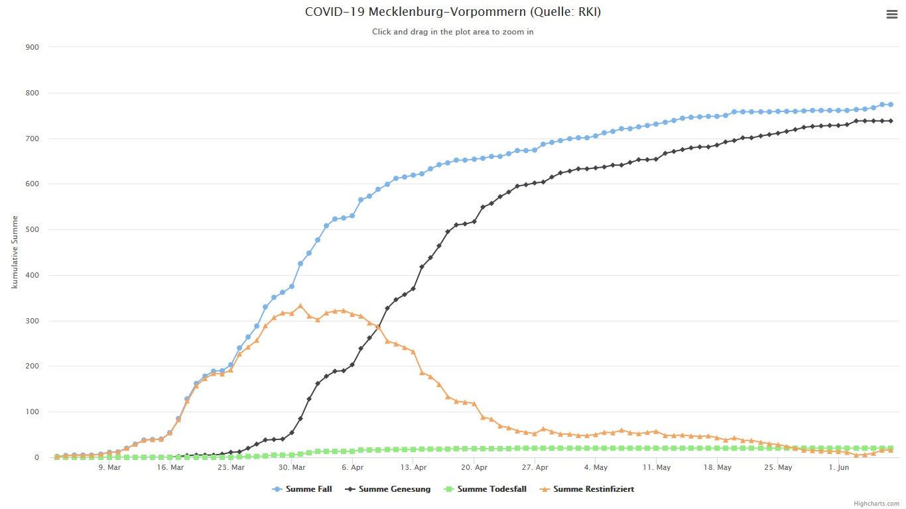
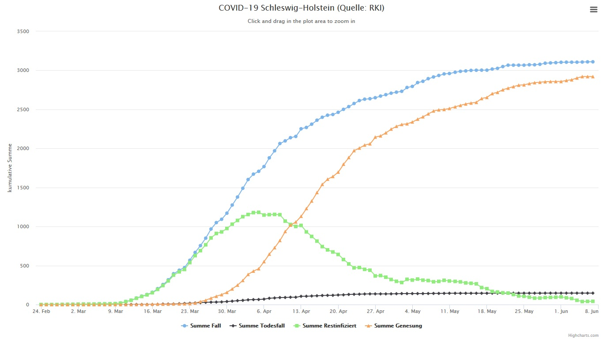

#

Wie es weiter geht:
===================

* 15.03.2020: Beginn inoffizieller Shutdown & Schließung Schulen
* 22.03.2020: Beginn offizieller Shutdown & Kontaktbeschränkungen
* 27.04.2020: Beginn schrittweiser Lockerungen & Maskenpflicht beim Einkaufen und im ÖPNV
* 15.06.2020: Reisewarnung für die Mitgliedsstaaten der Europäischen Union, für Schengen-assoziierte Staaten und für das Vereinigte Königreich werden ab dem 15. Juni 2020 aufgehoben. Binnengrenzkontrollen durch die Bundespolizei erfolgen bis zum 15. Juni 2020 weiterhin an den Grenzen zu Frankreich, Österreich und der Schweiz sowie bei ankommenden Flügen aus Italien und Spanien.

### Charts per 8. Juni 2020

