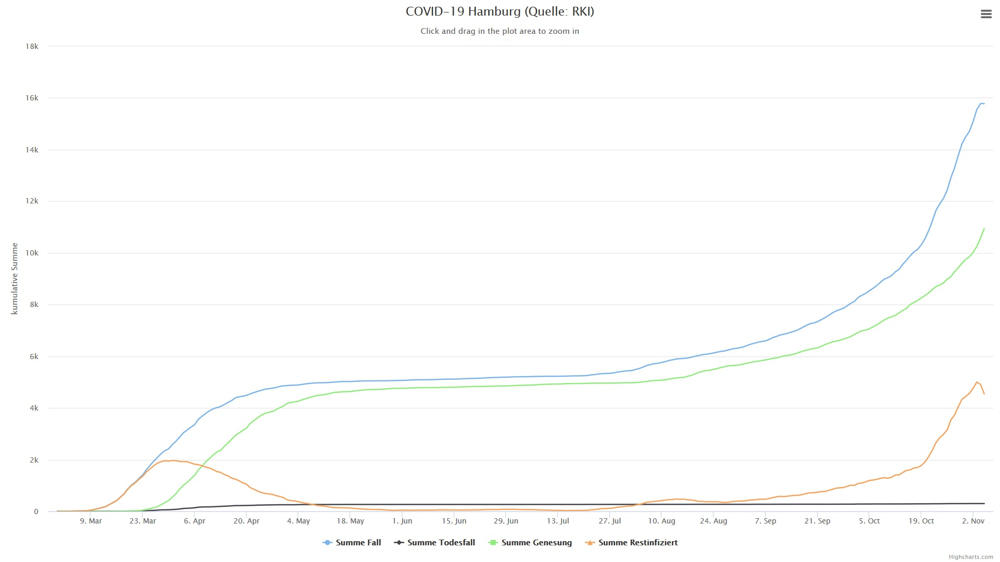
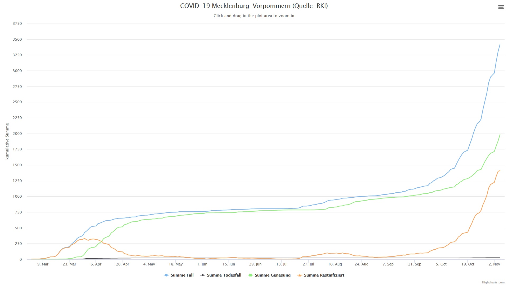
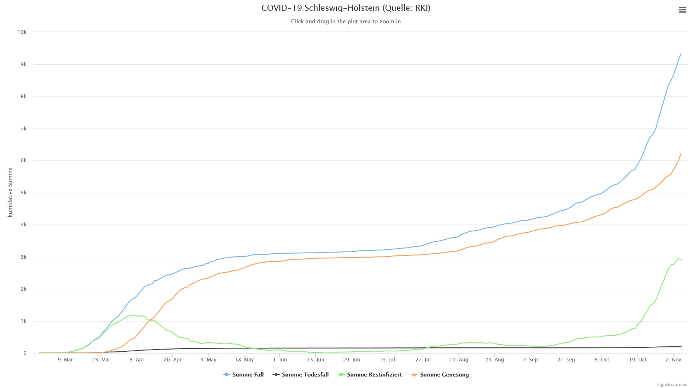

#

Wie es weiter geht:
===================

* 15.03.2020: Beginn inoffizieller Shutdown & Schließung Schulen
* 22.03.2020: Beginn offizieller Shutdown & Kontaktbeschränkungen
* 27.04.2020: Beginn schrittweiser Lockerungen & Maskenpflicht beim Einkaufen und im ÖPNV
* 15.06.2020: Reisewarnung und Grenzkontrollen innerhalb der Europäischen Union aufgehoben
* 22.06.2020: Beginn Sommerferien und Reisezeit
* 01.10.2020: Die zweite Welle nimmt Fahrt auf
* 02.11.2020: Beginn Teil-Lockdown für ganz Deutschland

### Charts per 5. November 2020

