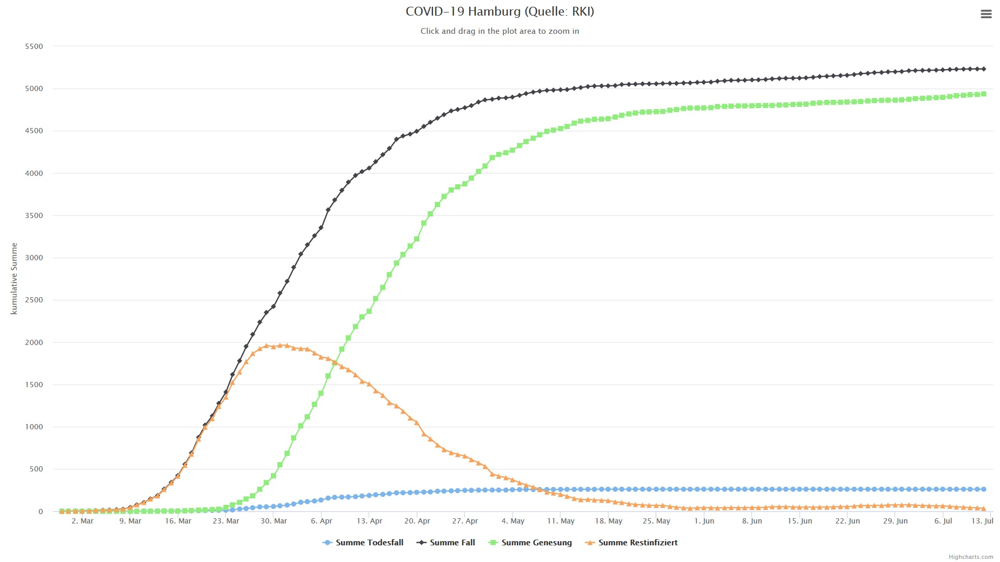
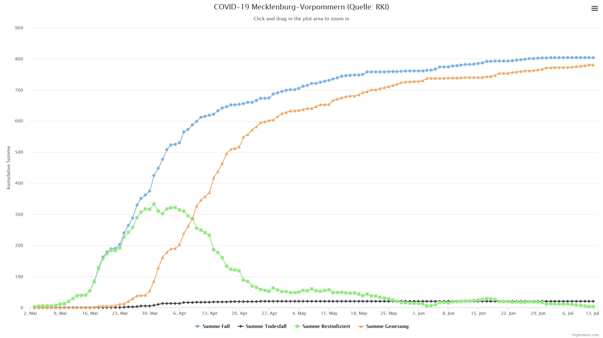
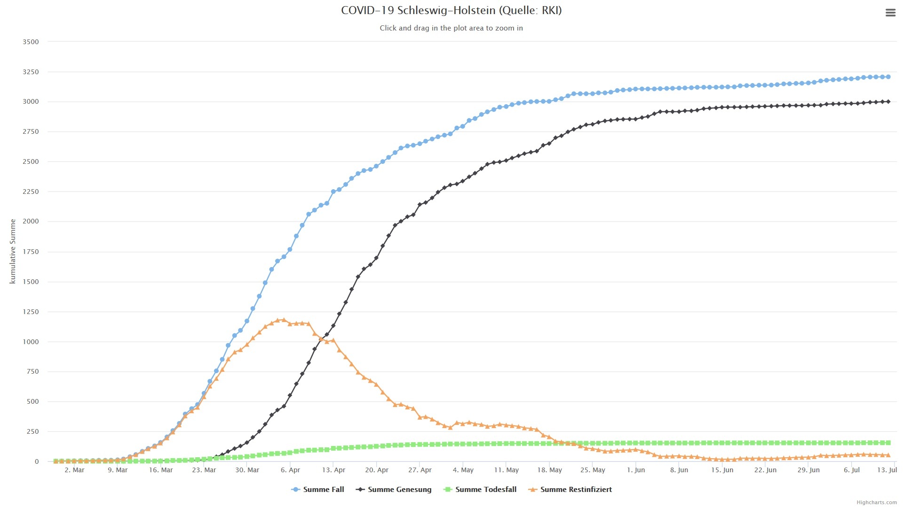

#

Wie es weiter geht:
===================

* 15.03.2020: Beginn inoffizieller Shutdown & Schließung Schulen
* 22.03.2020: Beginn offizieller Shutdown & Kontaktbeschränkungen
* 27.04.2020: Beginn schrittweiser Lockerungen & Maskenpflicht beim Einkaufen und im ÖPNV
* 15.06.2020: Reisewarnung und Grenzkontrollen innerhalb der Europäischen Union aufgehoben.
* 22.06.2020 bis 8.8.2020: Sommerferien MV, HH, SH

### Charts per 12. Juli 2020

